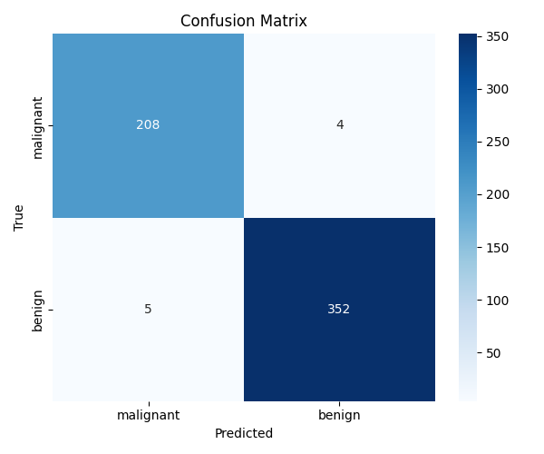
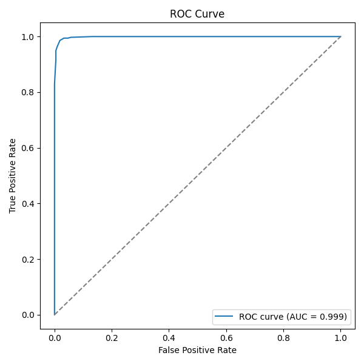
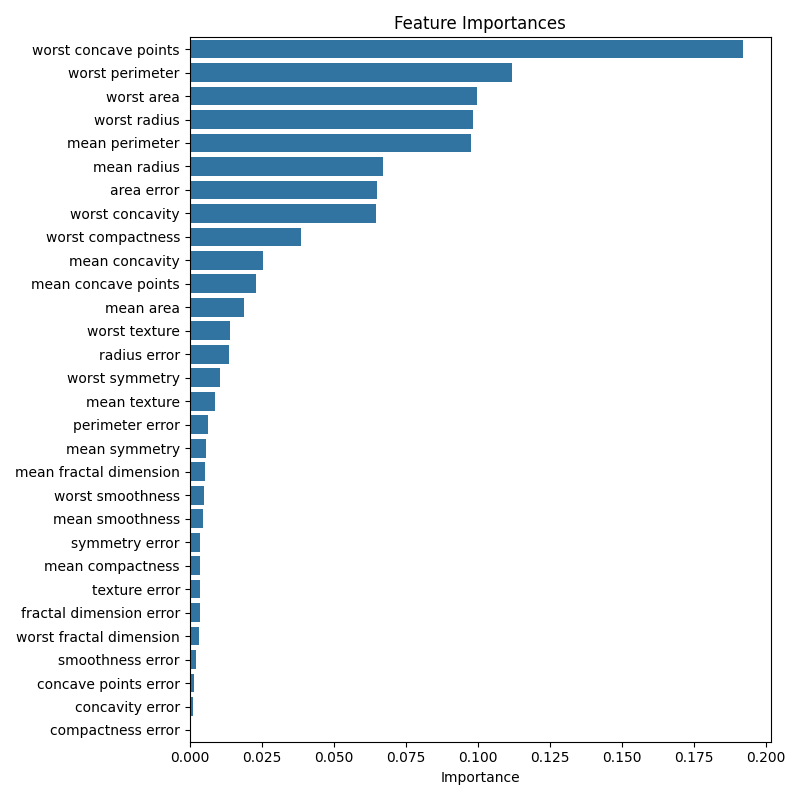

# Breast Cancer Prediction (Random Forest)

A compact example project that trains and serves a Random Forest classifier on the
scikit-learn built-in Breast Cancer dataset (`load_breast_cancer`). This repository
includes a command-line script for training, evaluating and creating prediction
reports, plus a small Flask app to serve predictions and the generated report.

Files
- `breast_cancer_predict.py`: CLI tool with `train`, `evaluate`, `predict`, and `report` commands.
- `flask_app.py`: Small Flask service exposing `/health`, `/predict` and `/report` endpoints.
- `requirements.txt`: Python package dependencies.

Requirements
- Python 3.8+ (3.10/3.11/3.13 tested)
- Recommended: virtual environment (venv)

Quick start (recommended)

1. Create and activate a virtual environment:

```bash
cd /home/kerstin/workspace/bysms
python3 -m venv .venv
source .venv/bin/activate
```

2. Install dependencies:

```bash
pip install -r requirements.txt
```

3. Train a model (quick smoke test):

```bash
python3 breast_cancer_predict.py train --model-path model.joblib --n-estimators 100
```

This prints test accuracy and saves the model to `model.joblib`.

CLI usage

- Evaluate saved model on the full dataset:

```bash
python3 breast_cancer_predict.py evaluate --model-path model.joblib
```

- Predict with the saved model:

```bash
# predict using dataset sample index 0
python3 breast_cancer_predict.py predict --model-path model.joblib --sample-index 0

# predict using 30 comma-separated feature values
python3 breast_cancer_predict.py predict --model-path model.joblib --features "17.99,10.38,..."
```

- Generate an evaluation report (images + an HTML page):

```bash
python3 breast_cancer_predict.py report --model-path model.joblib --out-dir reports
```

This creates `reports/report.html` and image files (confusion matrix, ROC curve,
feature importances) in the `reports/` folder.

Flask service

Start the Flask development server (for demo / local use):

```bash
.venv/bin/python flask_app.py
```

Endpoints
- `GET /health` — returns `{ "status": "ok" }`.
- `POST /predict` — JSON body either `{ "sample_index": 0 }` or `{ "features": [v1,...,v30] }`.
- `GET /report` — serves `reports/report.html` if it exists.
- `GET /reports/<file>` — serves generated images (e.g. `/reports/roc_curve.png`).

Example curl calls

```bash
curl http://127.0.0.1:5000/health

curl -X POST -H "Content-Type: application/json" -d '{"sample_index":0}' http://127.0.0.1:5000/predict

curl -X POST -H "Content-Type: application/json" -d '{"features":[17.99,10.38,122.8,1001.0,0.1184,0.2776,0.3001,0.1471,0.2419,0.0787,1.095,0.9053,8.589,153.4,0.006399,0.04904,0.05373,0.01587,0.03003,0.006193,25.38,17.33,184.6,2019.0,0.1622,0.6656,0.7119,0.2654,0.4601,0.1189]}' http://127.0.0.1:5000/predict
```

Serving in production

For production, use a WSGI server (gunicorn) and a process manager (systemd).

```bash
.venv/bin/python -m pip install gunicorn
MODEL_PATH=/path/to/model.joblib .venv/bin/gunicorn -w 4 -b 0.0.0.0:8000 flask_app:app
```

Viewing reports remotely

If you generated `reports/report.html` on the server, you can:

- Copy to local machine via `scp` and open in your browser; or
- Serve the `reports/` directory temporarily with Python's static server:

```bash
cd reports
python3 -m http.server 8000
# then open: http://<server-ip>:8000/report.html
```

Tips & troubleshooting

- If `python3 -m venv .venv` fails, ensure the system package `python3-venv` is installed.
- If `pip install` is blocked by PEP 668 / externally-managed environment, create a venv or ask your sysadmin to install packages.
- If the Flask app cannot bind to port 5000, check for running processes (`ps aux | grep flask_app.py`) and stop them (`pkill -f flask_app.py`).

Contributing

Feel free to open issues or PRs. Suggested improvements:
- Add data loading from CSV
- Add model serialization/versioning
- Add unit tests and CI

License

## Experimental Results

The following images were produced by the `report` command (see `breast_cancer_predict.py report`) and saved into the `reports/` folder. They are presented here in the same order they appear in the report output.

Reported accuracy (from the full dataset report): **0.9842**.

1) Confusion matrix



Description
- **What it shows:** The confusion matrix compares true labels (rows) against predicted labels (columns). The values are raw counts: 208 malignant correctly predicted as malignant (true positives), 4 malignant predicted as benign (false negatives), 5 benign predicted as malignant (false positives), and 352 benign correctly predicted as benign (true negatives). The total sample count is 569.
- **Why this image looks like this:** The Random Forest model separates the two classes very well on this dataset, so most samples fall on the diagonal (correct predictions). Small off-diagonal counts (4 and 5) indicate a few misclassifications. From these counts we can compute common diagnostics: sensitivity (recall for malignant) = 208/(208+4) ≈ 0.981, specificity (true-negative rate for benign) = 352/(352+5) ≈ 0.986, and the overall accuracy reported in the HTML is 0.9842. Note: these numbers are computed on the full dataset used for the report, which tends to be optimistic compared to a held-out test or cross-validation.

2) ROC curve



Description
- **What it shows:** The ROC (Receiver Operating Characteristic) curve plots the True Positive Rate (sensitivity) against the False Positive Rate for different decision thresholds. The legend in the plot lists the Area Under the Curve (AUC) — here shown as approximately 0.999.
- **Why this image looks like this:** An AUC near 1.0 indicates excellent separability of the two classes by the model's predicted probabilities. The curve rises steeply toward the top-left corner (high TPR for very low FPR), which visually corresponds to almost-perfect discrimination. Reasons for such a high AUC on this dataset include: (a) the breast-cancer features are informative and separable for this task, (b) Random Forests are powerful ensemble learners that capture non-linear interactions, and (c) this report uses the full dataset (not a strictly held-out test), so the metric may be overly optimistic. For more reliable performance estimates, use cross-validation or a dedicated test split when training and reporting metrics.

3) Feature importances



Description
- **What it shows:** A horizontal bar chart of the `feature_importances_` values from the trained Random Forest, sorted from most to least important. The top features (for example, `worst concave points`, `worst perimeter`, `worst area`, `worst radius`, `mean perimeter`) contributed most to the model's predictive performance according to the impurity-based importance measure.
- **Why this image looks like this:** Tree-based models like Random Forest compute feature importance by measuring how much each feature reduces node impurity across the trees. Features that split the data well (producing purer child nodes) receive higher importance scores. In medical imaging / tumor-measure datasets, features capturing tumor size and shape irregularities (radius, perimeter, concavity) are often strong indicators of malignancy, which explains their prominence. Caveats: impurity-based importances can be biased toward features with many distinct values or correlated features; permutation importance or SHAP values offer more reliable and interpretable alternatives.

Notes and recommendations
- The images and metrics in this section were generated by running:

```bash
python3 breast_cancer_predict.py report --model-path model.joblib --out-dir reports
```

- The performance numbers shown in the report (accuracy, AUC, etc.) are computed on the dataset used by the script (the entire `load_breast_cancer` data). For robust model evaluation, prefer cross-validation or a separate hold-out test set, and report mean ± std across folds.
- For clearer explanations of feature contributions consider adding permutation importance or SHAP explanations (these require extra packages and compute time but give more trustworthy attributions).

If you'd like, I can also: add numeric sensitivity/specificity/AUC values into the HTML report, compute cross-validated metrics, or include a SHAP summary plot and add it to the `reports/` output. Which would you prefer?

